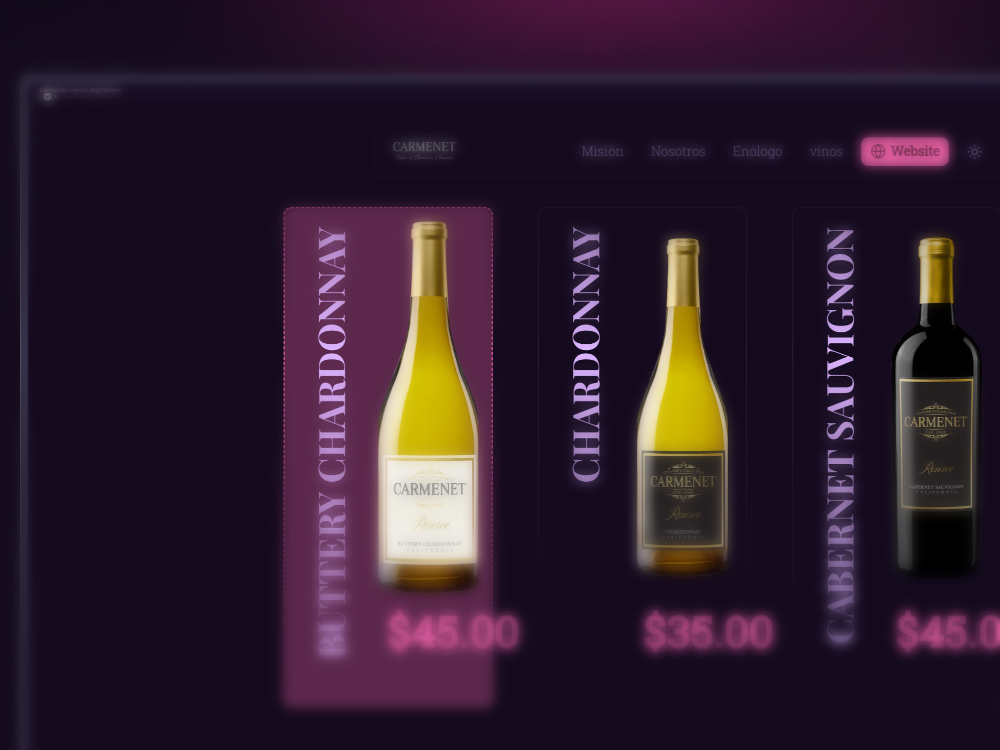
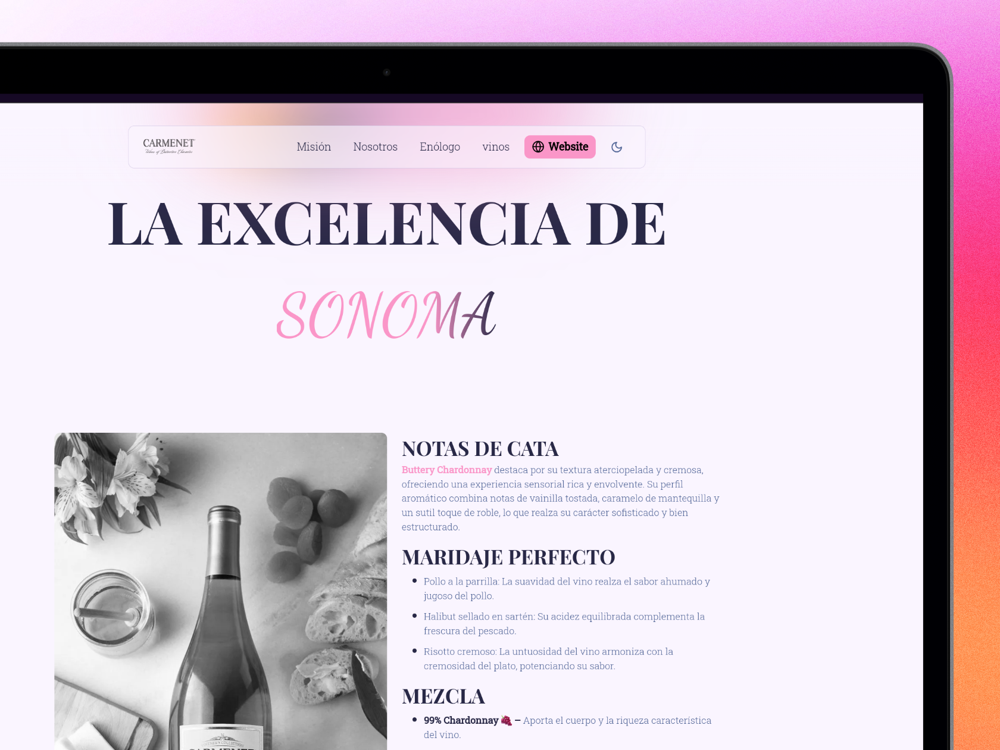
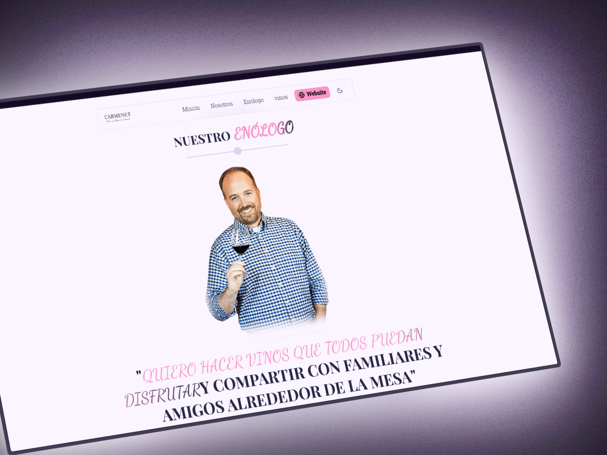
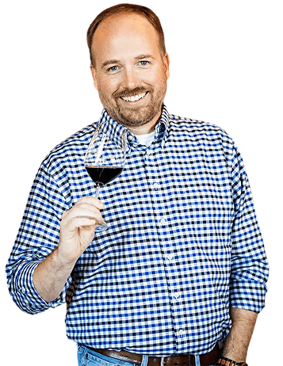

# 🍷 Clon del Sitio Web de CARMENET

  

  

  

  

Este es un proyecto educativo que recrea el sitio web de CARMENET, una reconocida bodega de California, utilizando Next.js 14.

## 📜 Sobre CARMENET

CARMENET (pronunciado "Car-men-ay") es una colección de vinos de California, fundada en 1983. La bodega es conocida por:

- Ser reconocida como Rising Star por Beverage Dynamics desde 2015
- Ser destacada como Hot Prospect en Shanken Impact (2015-2018)
- Estar comprometida con la elaboración de vinos consistentes y tradicionales
- Ofrecer vinos elegantes a precios accesibles

## 🎨 Sobre este Proyecto

Este clon educativo nace de mi interés por el desarrollo web y mi admiración por la marca CARMENET. El objetivo del proyecto es:

- Recrear la experiencia visual y funcional del sitio original
- Implementar buenas prácticas de desarrollo moderno
- Servir como ejemplo de integración de tecnologías actuales

## ⚡ Características Principales

- **Diseño Responsivo**: Se adapta a cualquier dispositivo
- **Modo Oscuro/Claro**: Sistema de temas basado en las preferencias del usuario
- **Animaciones Fluidas**: Implementadas con Framer Motion
- **Navegación Inteligente**: Detección de sección activa por scroll
- **Optimización de Imágenes**: Uso de next/image para mejor rendimiento
- **Tipado Estricto**: TypeScript para mayor seguridad
- **Estilos Modulares**: SASS con arquitectura escalable

## 🛠 Tecnologías Utilizadas

## 📱 Diseño Responsivo

El sitio está completamente optimizado para:

- Móviles (desde 320px)
- Tablets (desde 768px)
- Desktops (desde 1024px)
- Pantallas grandes (desde 1440px)

## 🎯 Objetivos Educativos

Este proyecto fue desarrollado con fines de aprendizaje, enfocándose en:

1. Implementación de arquitectura moderna en Next.js
2. Manejo avanzado de estados y animaciones
3. Optimización de rendimiento y SEO
4. Prácticas de accesibilidad web
5. Sistemas de diseño escalables

## 📝 Nota Legal

Este proyecto es un clon educativo y no tiene afiliación oficial con CARMENET. Todos los derechos de marca y contenido pertenecen a sus respectivos dueños.

## 👨‍💻 Desarrollo

Por [SHUN DEV](https://github.com/Luis-Fernando-MP) - Un desarrollador apasionado por crear experiencias web interesantes.

## 📬 Contacto

Para cualquier consulta sobre el desarrollo de este proyecto:

- GitHub: [@Shundev](https://github.com/Luis-Fernando-MP)
- Portfolio: [shundev.site](https://luisjp.vercel.app/)

---

Desarrollado con 🍷 por SHUN DEV
